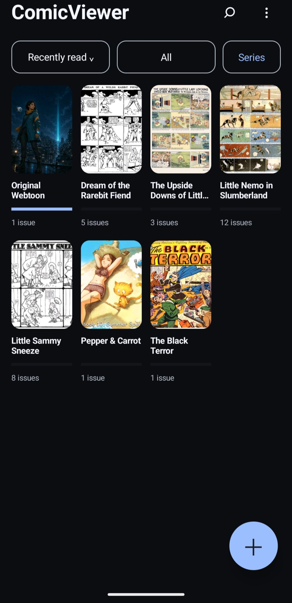
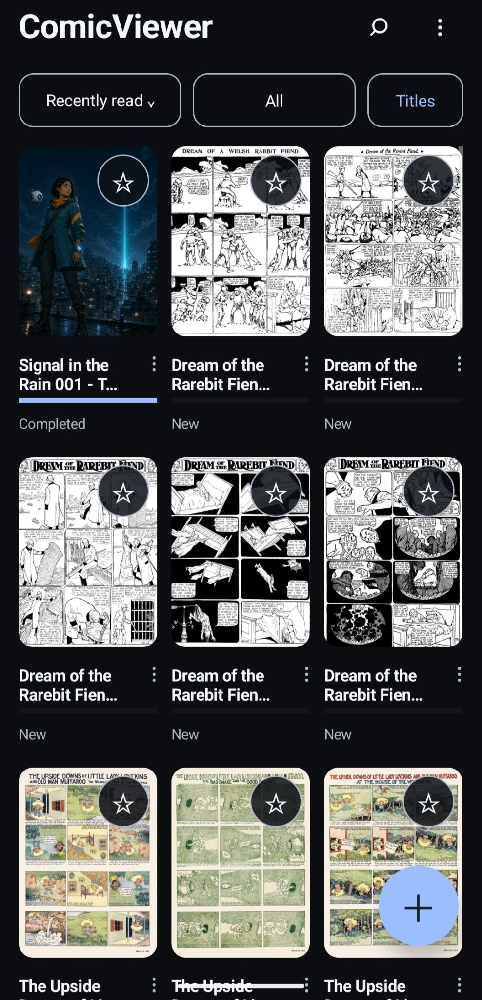
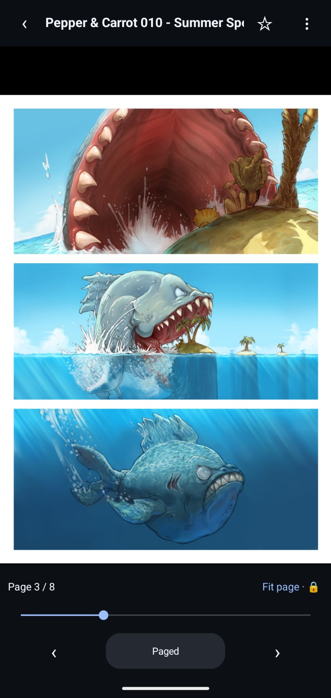
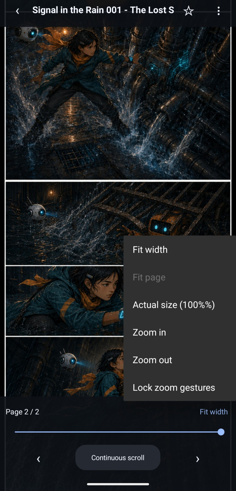
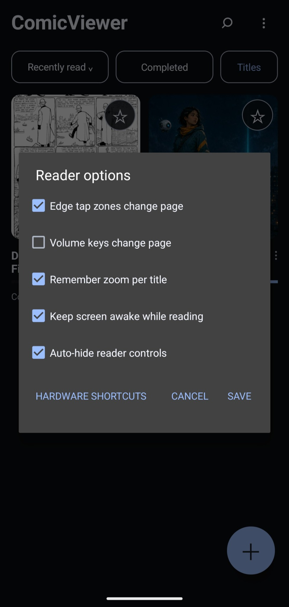

<p align="center">
  
</p>

# ComicViewer for Android

ComicViewer is a focused, offline comic reader for Android. It reads user-selected comics without
accounts, ads, analytics, subscriptions, network access, or broad storage permissions.

## Highlights

- CBZ, ZIP, image-based EPUB, and PDF support
- Paged and memory-conscious continuous-scroll reading
- Fit width, fit page, actual size, pinch zoom, double-tap zoom, and tiled rendering
- Per-title progress, zoom, scroll position, reading direction, bookmarks, and favorites
- Searchable cover library with filters, sorting, configurable density, and cached covers
- Optional recursive scanning of one user-selected library folder
- Series grouping from conservative metadata or folder structure, with manual correction
- Page previews while scrubbing, natural page ordering, and direct “open with” support
- English and Finnish interface resources
- Android 8.0 (API 26) through Android 16 (API 36)

## Screenshots

Browse grouped libraries, read traditional pages or long strips, and tune the reader to match your device.

<table>
  <tr>
    <td align="center"><br><sub>Series grouping</sub></td>
    <td align="center"><br><sub>Title library</sub></td>
    <td align="center"><br><sub>Paged reading</sub></td>
  </tr>
  <tr>
    <td align="center"><br><sub>Continuous scrolling</sub></td>
    <td align="center"><br><sub>Reader options</sub></td>
  </tr>
</table>

<sub>Sample artwork includes [Pepper & Carrot — Episode 10: Summer Special](https://www.peppercarrot.com/en/webcomic-sources/ep10_Summer-Special.html): art and scenario by David Revoy, English translation by Alex Gryson, and the Hereva universe by David Revoy; licensed under [CC BY 4.0](https://creativecommons.org/licenses/by/4.0/). “Signal in the Rain” is an original [CC0](https://creativecommons.org/publicdomain/zero/1.0/) test sample.</sub>

## Privacy by design

ComicViewer requests no Android permissions, including no `INTERNET`, storage, or media permission.
Files are opened through Android's system document picker, which grants access only to items the user
chooses. The app has no Google Play Services, Firebase, advertising, analytics, telemetry, account,
or third-party runtime library.

See the full [privacy policy](PRIVACY.md) and
[security model](docs/SECURITY_MODEL.md).

## Install

Download `ComicViewer-Android-vX.Y.Z.apk` from the
[latest GitHub Release](../../releases/latest). Android may ask you to allow installation from the
app used to open the APK.

Android accepts an update only when the application ID and signing certificate match. Builds from a
different distribution channel may use a different certificate and therefore require uninstalling
the existing app first.

### Obtainium

Add this repository's public URL to Obtainium. Stable releases use matching `vX.Y.Z` tags and
Android version names, an increasing version code, and one APK named
`ComicViewer-Android-vX.Y.Z.apk`.

## Basic controls

| Gesture or control | Result |
|---|---|
| Tap the left or right edge | Previous or next page, adjusted for reading direction |
| Swipe horizontally while fitted | Previous or next page |
| Drag | Pan a zoomed page or scroll vertically |
| Pinch | Zoom around the gesture focus |
| Double tap | Zoom in or return to Fit width |
| Center tap | Show or hide reader controls |
| `Paged` / `Continuous` control | Change reading mode |
| Page slider | Preview and open another page |

The [user guide](docs/USER_GUIDE.md) covers importing, library folders, series grouping, reading
modes, controls, and local data behavior.

## Build from source

Requirements are JDK 17, Android SDK Platform 36, and Android SDK Build Tools 35.0.1.

```bash
cp local.properties.example local.properties
# Set sdk.dir in local.properties, then:
./gradlew --dependency-verification strict testDebugUnitTest lintRelease assembleRelease
```

Without local signing configuration, the release build is intentionally unsigned. Detailed Gradle,
direct-SDK, and reproducibility instructions are in [docs/BUILDING.md](docs/BUILDING.md).

## Scope

CBR/RAR and CB7/7z are intentionally unsupported. EPUB support is limited to fixed-layout or
consistently single-image spine pages; ComicViewer is not a general reflowable ebook reader.

## Contributing and security

Contributions should preserve the app's narrow offline purpose and zero-permission runtime. See
[CONTRIBUTING.md](CONTRIBUTING.md) and the [vulnerability-reporting policy](SECURITY.md).

ComicViewer is free and open-source software under the [MIT License](LICENSE). Build-time and
test-only components are documented in [THIRD_PARTY_NOTICES.md](THIRD_PARTY_NOTICES.md).
